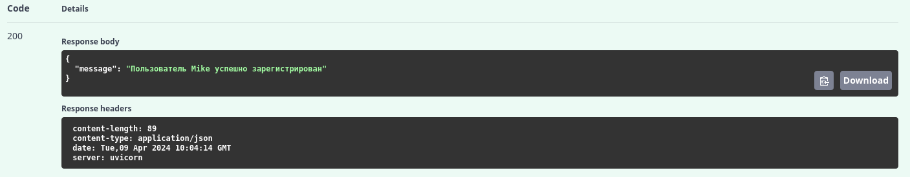

# API обмена валют
Проект на FastAPI, который служит простым приложением для обмена валюты.
Пользователи могут получать последние курсы обмена различных валют и выполнять конвертацию валют.
Проект включает аутентификацию JWT для доступа пользователей и интеграцию с открытым API обменных курсов для получения данных об обменных курсах в режиме реального времени.

### Используемые технологии: 
* Python
* FastAPI
* Pydantic
* JWT
* Pytest

### Запуск проекта
1. Клонируйте проект с помощью команды:  
git clone https://github.com/mike-sazonov/FastAPI_currency_project.git
2. Настройте виртуальную среду
3. В корне проекта создайте файл .env и заполните своими данными по примеру: 
SECRET_KEY = mysecretkey   ALGORITHM = algorithm   API_KEY = api_key
4. Запустите проект через файл main.py
### Примеры запросов к API с помощью Swagger UI
#### Регистрация пользователя:  
Запрос

Ответ

#### Аутентификация пользователя:  
Запрос

Ответ

#### Получение списка доступных валют:  
Запрос

Ответ

#### Конвертация валюты:  
Запрос

Ответ

